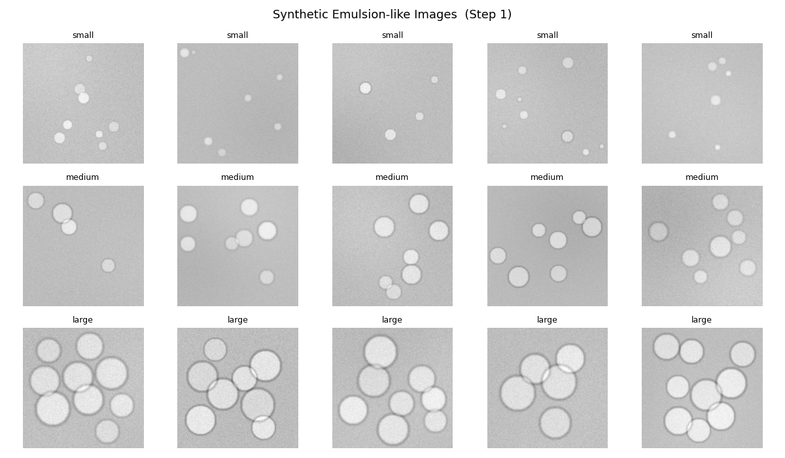
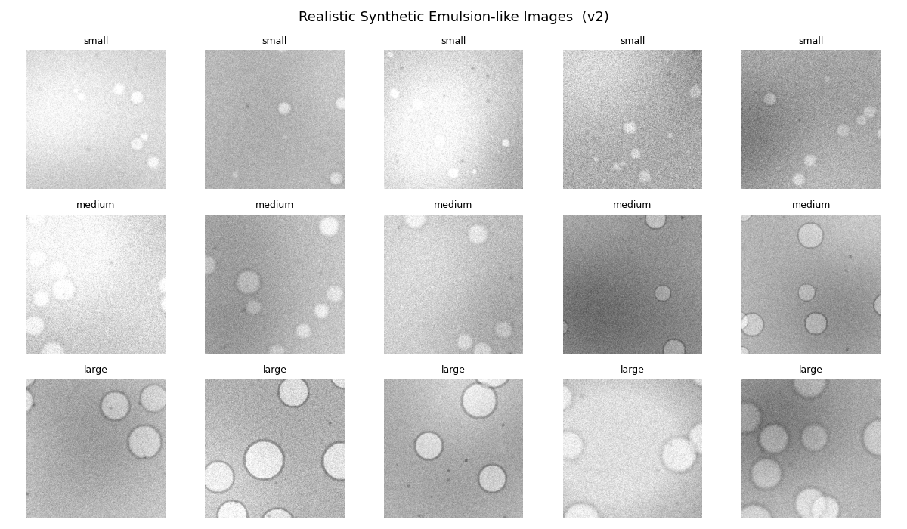
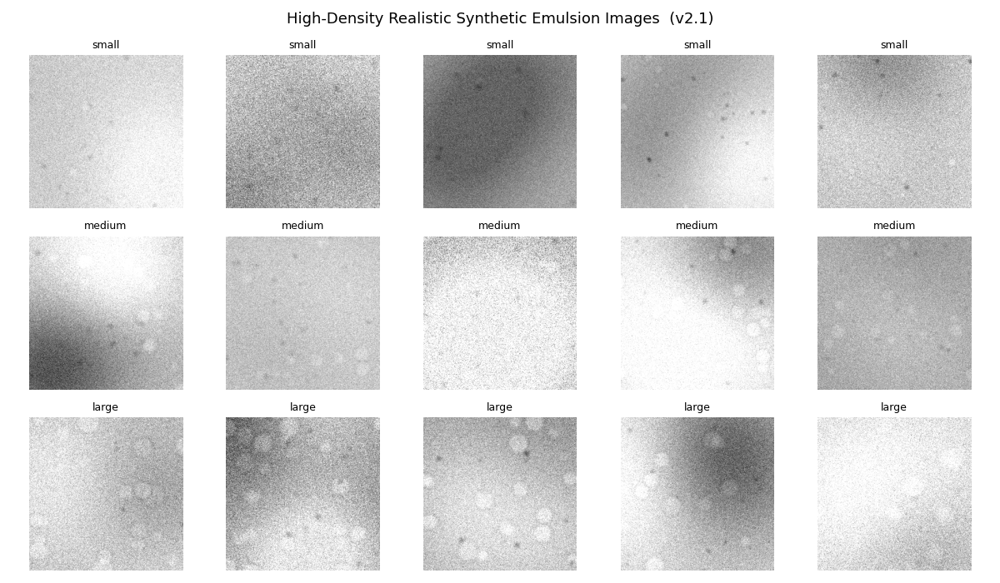
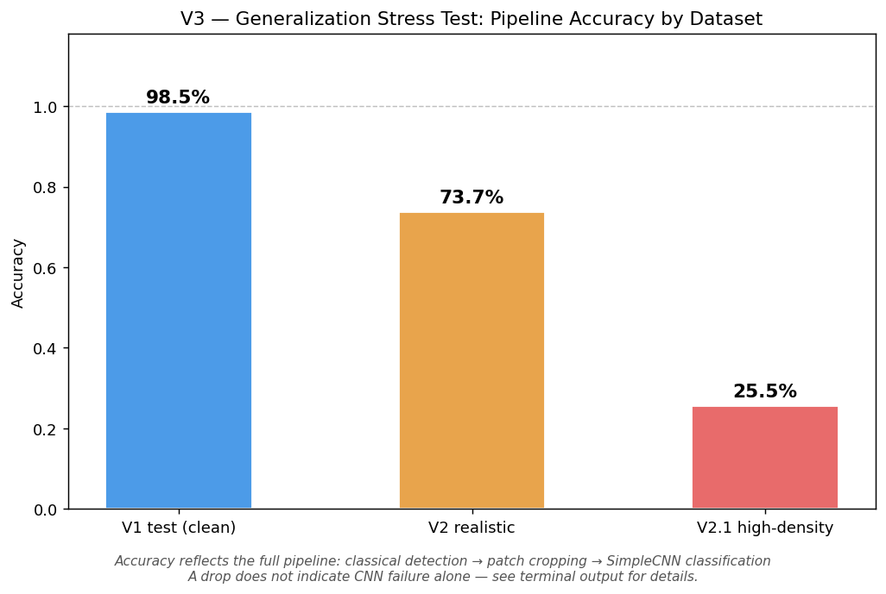
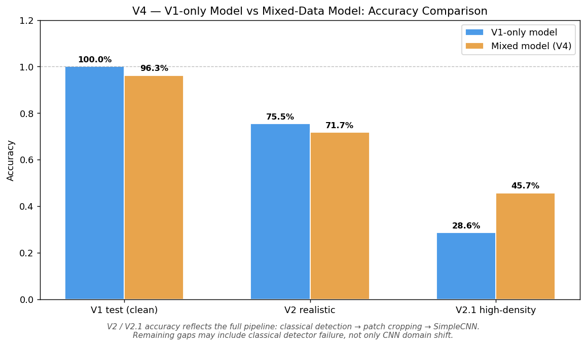
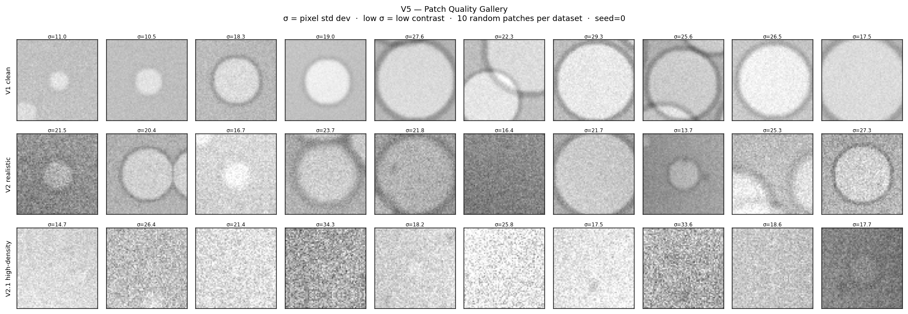
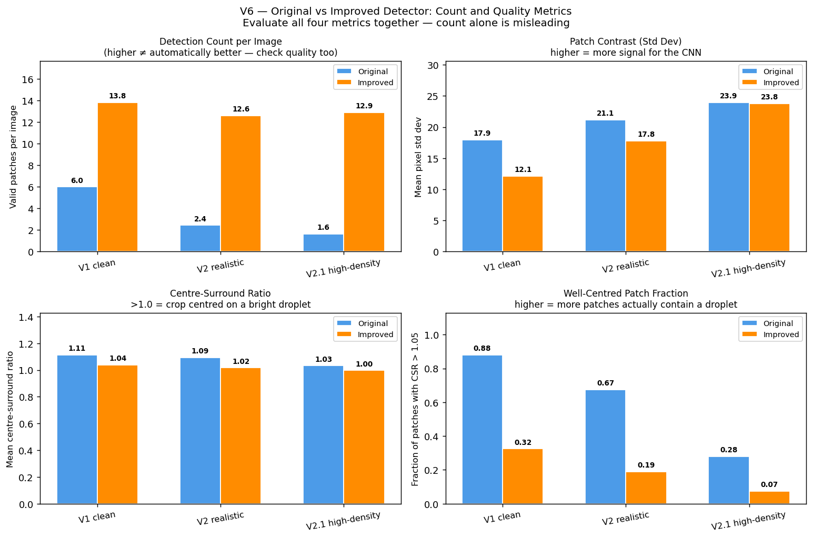
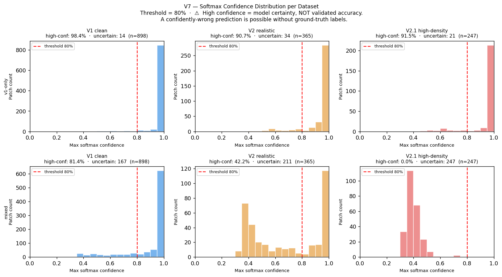
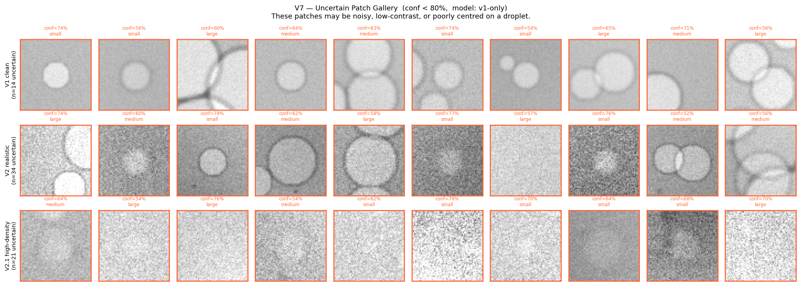

# Emulsion-like Microscopy Image Analysis Workflow

This project builds a staged Python workflow for synthetic and AI-generated emulsion-like
microscopy images, combining classical image analysis, CNN classification, robustness testing,
failure diagnosis, and confidence-aware analysis.

---

## Why this project exists

In microscopy-based experiments, researchers sometimes need to inspect images and count or
classify particles manually — for example, identifying droplets by size.
This manual process can be:

- **slow** — inspecting images one by one takes time
- **subjective** — two people may draw different boundaries around the same droplet
- **difficult to reproduce** — results can vary between sessions or observers

The difficulty grows when the images are not clean. Real microscopy images often contain:

- small droplets that are hard to spot
- droplets that overlap or touch each other
- uneven brightness across the image
- noise and blur
- droplets that are cut off at the image edge
- dust or artifact spots

This project explores whether a computer-based workflow — using rule-based image processing and
a small neural network — can make droplet analysis more structured and consistent.

---

## What this project is NOT

Before reading further, please keep this in mind:

- **This is not a validated real microscopy image analyzer.**
- **This project does not claim high accuracy on real microscopy images.**
- All images used here are **synthetic** — generated by code, not photographed under a microscope.
- There is **no human-labeled real microscopy ground truth** in this repository.

Therefore, the results in this project should be understood as:
- a demonstration of how such a workflow could be built
- a test of what happens when conditions become harder
- a diagnosis of where the pipeline fails and why

Not as: a validated tool ready for real experimental use.

---

## Understanding the key ideas

If you are new to image analysis or machine learning, here are four concepts that appear
throughout this project.

### Classical image analysis

Classical image analysis means using hand-written rules to process an image —
not learning from examples, but applying fixed steps like:

- smoothing the image to reduce noise
- separating bright regions from dark ones (thresholding)
- measuring the shape and size of each region

This approach works well when images are clean and consistent,
but it can struggle when images are noisy or complex.

### CNN (Convolutional Neural Network)

A CNN is a type of neural network that learns to recognize visual patterns from examples.
In this project, the CNN is shown many small images of droplets (called *patches*),
each labelled as small, medium, or large.
After training, it can predict the size class of a new droplet patch it has not seen before.

The CNN used here is a simple, custom-built model with two convolutional layers.
It is trained from scratch — no pre-trained weights from other datasets are used.

### Pseudo-label

A pseudo-label is a label assigned automatically — not verified by a human expert.
In this project, labels are generated by the synthetic data script
(since we control exactly what goes into each image).
This makes the workflow fully reproducible, but it also means the labels
are only as reliable as the code that created them.

### Confidence

When the CNN makes a prediction, it outputs a score for each class.
The highest score is called the *confidence* of the prediction.
A high confidence means the model is very sure about its answer.

But here is the important warning: **high confidence does not always mean correct.**
A model can be wrong in a very confident way — especially when tested on images
that look different from what it was trained on.
This project explores exactly that problem.

---

## The project, step by step

This project was built in seven stages.
Each stage added a new layer of difficulty or a new diagnostic question.
Reading them in order tells the full story of what worked, what failed, and why.

---

### V1 — Clean synthetic baseline

**What was built:**
150 synthetic emulsion-like images were generated by code.
Each image contains circular droplets — labelled as small, medium, or large.
A classical detection pipeline found the droplets, and a SimpleCNN was trained to classify them.

**What happened:**
The model performed very well on clean test images.

**Why this makes sense:**
The images were generated under perfectly controlled conditions —
consistent brightness, well-separated droplets, no noise.
The task was easy. The result looked promising, but it was also optimistic.

---

### V2 — More realistic synthetic images

**What was added:**
The synthetic images were made harder:
uneven background brightness, stronger noise, variable blur,
droplets partially cut off at image edges, and dust-like spots.

**Why this matters:**
Real microscopy images are almost never perfectly clean.
Any workflow that only works on clean images is unlikely to transfer to real experiments.

---

### V2.1 — High-density small-droplet images

**What was added:**
A new set of even harder images: more droplets per image, smaller radii, weaker contrast,
more overlap between neighbouring droplets.

**Why this matters:**
In dense emulsions, droplets are packed close together.
Finding and correctly cropping individual droplets becomes much harder.
This stage was designed to push the pipeline toward a realistic failure mode.

---

### V3 — Generalization stress test

**What happened:**
The V1-trained model was tested on the V2 and V2.1 images, without retraining.

**The result:**
Performance dropped significantly on both harder datasets.

**What this means:**
A model that looks good on clean synthetic data may fail when conditions change.
This is called a **generalization problem** — the model learned to recognize
droplets in clean images but not in noisier or denser ones.

> Note: this test evaluates the **full pipeline** — classical detection, patch cropping,
> and CNN classification all together. A drop in accuracy could come from any of these steps,
> not only from the CNN.

---

### V4 — Mixed-data training

**What was tried:**
Instead of training only on clean data, a new model was trained on a mix of all three datasets
(V1 + V2 + V2.1) with data augmentation (random flips, rotation, blur, brightness changes).
This new model was saved separately — the original model was not overwritten.

**The result:**
The high-density case improved noticeably.
The realistic case improved only slightly.
Neither was fully solved.

**What this means:**
Training on more diverse data helps, but it is not enough on its own.
The pipeline still has underlying problems that more training data alone cannot fix.

---

### V5 — Patch quality diagnosis

**What was asked:**
When the model fails, is the problem in the CNN's classification?
Or is the problem earlier — in how droplets were detected and cropped?

**How it was checked:**
Each droplet patch was measured for:
- how much visible structure it contained (pixel standard deviation)
- whether the detected droplet was actually centred in the crop (center-surround ratio)

**The finding:**
Many patches from the high-density images had low structure and poor centring.
This means the classical detector was placing crops on background regions,
not on actual droplets.
The CNN was being given bad inputs — and bad inputs produce bad outputs,
regardless of how well the model was trained.

---

### V6 — Detector experiment

**What was tried:**
A more aggressive detection pipeline was tested, using background subtraction,
contrast enhancement (CLAHE), and a local adaptive threshold instead of Otsu's method.
This new detector was compared to the original side by side.
The original detector code was not modified.

**The finding:**
The improved detector found more candidate regions — especially on dense images.
But patch quality metrics showed that the extra detections were often low-quality:
background regions, partial droplets, noise blobs.

**What this means:**
More detections do not automatically mean better detections.
A detector that is too aggressive may introduce more noise into the pipeline,
not less. Detection count alone is a misleading metric.

---

### V7 — Confidence-aware analysis

**What was asked:**
If we cannot trust accuracy labels on realistic data, can we at least identify
which predictions the model is uncertain about?

**What was done:**
The model's softmax confidence scores were recorded for every patch.
Patches below a confidence threshold (0.80) were flagged as uncertain.
The relationship between patch quality and model confidence was also examined.

**The finding:**
The model did show lower average confidence on harder images — a useful signal.
However, some low-quality patches still received high-confidence predictions.

**The important warning:**
Softmax confidence is not validated accuracy.
The model can be confidently wrong.
Without human-labeled real images, there is no way to verify which predictions are correct.
Flagging uncertain predictions is useful, but it does not replace ground-truth validation.

---

## Question & Finding

| Question | Finding |
|---|---|
| Does clean synthetic training work? | Yes — but mainly on similarly clean synthetic test data. |
| Does the model generalize to harder synthetic images? | Not fully. Performance drops under realistic and high-density conditions. |
| Does mixed-data training help? | Partly. It improves the high-density case, but does not fully solve robustness. |
| Is detection count enough to judge detector quality? | No. More detections can also mean more false positives or low-quality patches. |
| Does high softmax confidence mean the prediction is correct? | No. Confidence is model certainty, not validated accuracy. |

---

## How to run this project

### Set up the environment

```bash
python -m venv .venv

# Windows:
.venv\Scripts\activate

# macOS / Linux:
source .venv/bin/activate

pip install -r requirements.txt
```

### Core pipeline (V1) — run these in order

```bash
python src/generate_data.py      # generate clean synthetic images
python src/classical.py          # detect droplets with classical processing
python src/train_classifier.py   # train SimpleCNN and save model + figures
```

### Generate harder synthetic data (V2 and V2.1)

```bash
python src/generate_realistic_data.py               # realistic images
python src/generate_high_density_realistic_data.py  # high-density images
```

### Stress test and mixed training (V3 and V4)

```bash
python src/stress_test_generalization.py  # test V1 model on harder data
python src/train_mixed_classifier.py      # train new model on mixed data
```

### Diagnostics (V5, V6, V7)

```bash
python src/analyze_patch_quality.py        # diagnose patch and detection quality
python src/improve_detector.py             # compare original vs improved detector
python src/analyze_prediction_confidence.py  # confidence and uncertainty analysis
```

Each script saves its outputs to the `results/` folder and prints a summary to the terminal.

---

## Result figures

The figures below were generated by running the pipeline.
They are shown here in the same order as the project stages above.

---

**V1 — Clean synthetic images**



*Each row shows a different size class: small (top), medium (middle), large (bottom).
Notice that the images look clean and well-separated — this is what makes V1 easy.*

---

**V2 — Realistic synthetic images**



*The same three size classes, but now with noise, variable blur, uneven illumination,
and droplets that are partially cut off at the image edge.*

---

**V2.1 — High-density small-droplet images**



*Many more droplets per image, smaller radii, weaker contrast, and heavy background variation.
This is the hardest scenario in this project.*

---

**V3 — Generalization stress test: accuracy comparison**



*Accuracy is high on V1 (clean), drops on V2 (realistic), and drops further on V2.1
(high-density). The same model, tested on three different levels of difficulty.*

---

**V4 — Mixed training: accuracy comparison**



*The mixed-trained model (right bars) performs better on high-density data
but does not consistently improve on realistic data.
Training on more data helps — but not completely.*

---

**V5 — Patch quality gallery**



*Patches from V1 tend to be well-centred on actual droplets.
Patches from V2.1 often show background regions, blurry content, or partial objects —
these are the inputs the CNN is trying to classify.*

---

**V6 — Detector comparison: count and quality metrics**



*The improved detector finds more candidates (left bars), but patch quality metrics
(right bars) show that many extra detections are low-quality crops.
More detections do not automatically mean better detections.*

---

**V7 — Confidence distribution**



*The model is more confident on V1 (clean) data and less confident on harder datasets.
The vertical line marks the 0.80 threshold — patches to the left are flagged as uncertain.*

---

**V7 — Uncertain patch gallery**



*These are patches where the model was unsure of its prediction (confidence below 0.80).
Many of them look genuinely ambiguous — blurry, partial, or poorly centred.*

---

## Future work

To move from workflow demonstration to real validation, the next step is
to test this pipeline on real microscopy images with human-labeled ground truth.

---

## Project structure

```
deep-learning-emulsion/
├── data/
│   ├── raw/                              # V1 clean synthetic images    (not committed)
│   ├── realistic_raw/                    # V2 realistic images          (not committed)
│   ├── high_density_raw/                 # V2.1 high-density images     (not committed)
│   ├── patches/                          # V1 droplet patches           (not committed)
│   ├── metadata.csv
│   ├── realistic_metadata.csv
│   └── high_density_metadata.csv
├── notebooks/
│   └── 01_demo_workflow.ipynb
├── results/                              # Figures and model weights (committed)
├── src/
│   ├── generate_data.py                          # V1
│   ├── classical.py                              # V1
│   ├── dataset.py                                # V1
│   ├── model.py                                  # V1
│   ├── train_classifier.py                       # V1
│   ├── generate_realistic_data.py                # V2
│   ├── generate_high_density_realistic_data.py   # V2.1
│   ├── stress_test_generalization.py             # V3
│   ├── train_mixed_classifier.py                 # V4
│   ├── analyze_patch_quality.py                  # V5
│   ├── improve_detector.py                       # V6
│   └── analyze_prediction_confidence.py          # V7
├── requirements.txt
├── README.md
└── PROJECT_STATUS.md
```

---

## Environment

Python 3.9+ · Windows / macOS / Linux · CPU required · GPU auto-used if available
